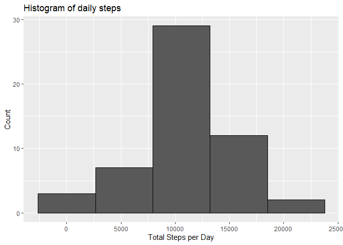
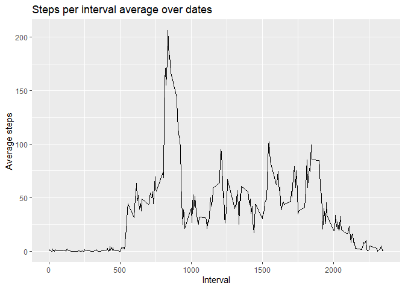
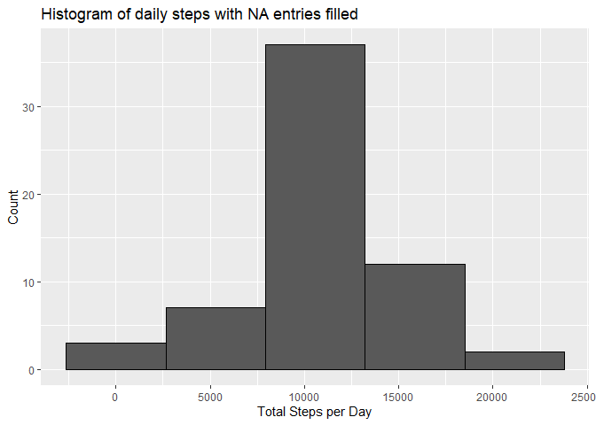
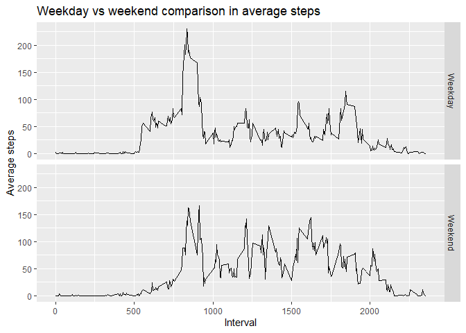

## Loading and preprocessing the data


```r
library(ggplot2)
```

```
## Warning: package 'ggplot2' was built under R version 4.2.1
```

```r
library(dplyr)
```

```
## 
## Attaching package: 'dplyr'
```

```
## The following objects are masked from 'package:stats':
## 
##     filter, lag
```

```
## The following objects are masked from 'package:base':
## 
##     intersect, setdiff, setequal, union
```

```r
library(lattice)
library(reshape2)

#Load Data
df <- read.csv("activity.csv")
#Change to date format
df$date <- as.Date(df$date, "%Y-%m-%d")

df_copy <- data.frame(df)

# Use only valid steps
df <- df[!is.na(df$steps),]
```

## What is mean total number of steps taken per day?


```r
#Calculate and plot histogram of the total number of steps taken per day
steps <- tapply(df$steps, df$date, sum, simplify=TRUE)
data_frame(steps = steps) %>% ggplot(., aes(steps)) + 
  geom_histogram(bins = 5,color="black")+
  labs(x="Total Steps per Day", y = "Count", title="Histogram of daily steps")
```

```
## Warning: `data_frame()` was deprecated in tibble 1.1.0.
## Please use `tibble()` instead.
## This warning is displayed once every 8 hours.
## Call `lifecycle::last_lifecycle_warnings()` to see where this warning was generated.
```

<!-- -->

```r
# Median and mean of daily steps
print(summary(steps))
```

```
##    Min. 1st Qu.  Median    Mean 3rd Qu.    Max. 
##      41    8841   10765   10766   13294   21194
```

## What is the average daily activity pattern?


```r
interval_ave <-  tapply(df$steps, df$interval, mean, simplify=TRUE)
interval_ave <- data.frame(interval=as.integer(names(interval_ave)),average=interval_ave)
ggplot(interval_ave, aes(x=interval, y = average)) +
  geom_line()+labs(x="Interval", y = "Average steps", title="Steps per interval average over dates")
```

<!-- -->

```r
max_interval <- interval_ave[which.max(interval_ave$average), "interval"]
print(paste("Interval with maximum average steps is: ", as.character(max_interval)))
```

```
## [1] "Interval with maximum average steps is:  835"
```

## Imputing missing values


```r
# get the NA indices
mask <- is.na(df_copy$steps)
num_na <- sum(mask)
print(paste("Number of NA entries: ", num_na))
```

```
## [1] "Number of NA entries:  2304"
```

```r
# compute the interval steps averaged over days
interval_ave <-  tapply(df_copy[!mask, "steps"], df_copy[!mask, "interval"], 
                        mean, simplify=TRUE)
#Set na values to interval steps averaged over days
for (i in which(mask)) {
  df_copy[i, "steps"] <- interval_ave[as.character(df_copy[i,"interval"])]
}

#Plot histogram and show median and mean
steps2 <- tapply(df_copy$steps, df_copy$date, sum, simplify=TRUE)
data_frame(steps = steps2) %>% ggplot(., aes(steps)) + 
  geom_histogram(bins = 5,color="black")+
  labs(x="Total Steps per Day", y = "Count", title="Histogram of daily steps with NA entries filled")
```

<!-- -->

```r
# Median and mean of daily steps
print(summary(steps2))
```

```
##    Min. 1st Qu.  Median    Mean 3rd Qu.    Max. 
##      41    9819   10766   10766   12811   21194
```
Upon visible inspection, there is no dramatic effect by filling the NA entries.  


## Are there differences in activity patterns between weekdays and weekends?

```r
df_copy["day"] = weekdays(df_copy$date)
df_copy["weekend"] = df_copy$day %in% c("Saturday","Sunday")
steps <- tapply(df_copy$steps, list(df_copy$weekend, df_copy$interval), mean)
steps <- data.frame(t(steps))
names(steps) <- c("Weekday","Weekend")
steps <- cbind(interval = as.integer(rownames(steps)), steps)
rownames(steps) <- 1:nrow(steps)
steps <- melt(steps, id=c("interval"))
ggplot(steps, aes(interval, value)) +  geom_line()+ facet_grid(variable ~ .)+
  labs(x="Interval", y="Average steps", 
       title="Weekday vs weekend comparison in average steps")
```

<!-- -->

